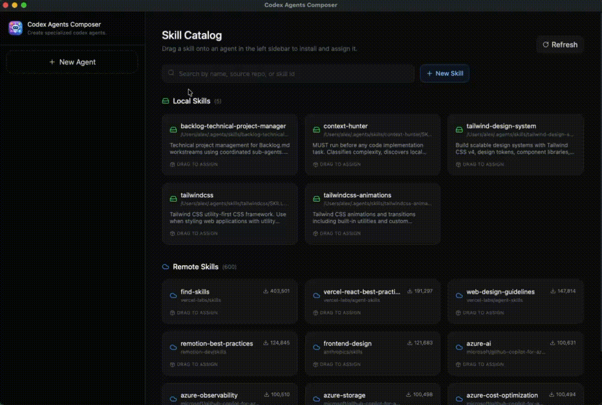

<p align="center">
  
</p>

<h1 align="center">Codex Agents Composer</h1>

<p align="center">
  A desktop application for managing your Codex agents and their skills.
</p>

---

<p align="center">
  
</p>

## Overview

Codex Agents Composer provides a visual interface for creating, configuring, and organizing Codex agents. Instead of editing configuration files by hand, you can manage everything through a straightforward desktop app — define agents, assign skills, and fine-tune settings in one place.

## Features

- **Agent management** — Create and configure Codex agents with a friendly UI. Set models, reasoning levels, and developer instructions without touching config files.
- **Skill catalog** — Browse available skills from the [skills.sh](https://skills.sh) repository or create your own in the integrated editor.
- **Drag-and-drop assignment** — Assign skills to agents by dragging them from the catalog. Reorder or remove assignments just as easily.
- **Persistent configuration** — All changes are saved to your Codex config (`~/.codex/`), so agents and skills are ready to use from the command line immediately.

## Installation

Requires [Bun](https://bun.sh).

```bash
bun install
```

## Usage

```bash
bun run dev:hmr
```

This starts the app with hot module reloading for the UI.

Alternatively, to run without HMR:

```bash
bun run start
```

## Building

To produce a distributable application bundle:

```bash
bun run build:app
```

## License

MIT
